# Priority Watersheds for Wetland Conservation


## Priority Watershed Analysis Methodology

This analysis identifies priority watersheds for wetland conservation
based on a composite score that integrates multiple conservation
criteria. We use HydroBASINS Level 6 watersheds as our spatial units of
analysis.

### Data Sources

The analysis integrates the following global datasets:

1.  **Wetlands**: Global Lakes and Wetlands Database (GLWD) - provides
    wetland extent and type
2.  **Carbon Storage**: Vulnerable carbon data from Conservation
    International - represents irrecoverable carbon stocks
3.  **Protected Areas**: World Database on Protected Areas (WDPA) -
    identifies existing conservation coverage
4.  **Biodiversity Value**: Nature’s Contributions to People (NCP)
    scores - biodiversity and ecosystem service importance
5.  **Watersheds**: HydroBASINS Level 6 - watershed boundaries for
    analysis units

### Composite Score Calculation

Each watershed receives a **composite score** (0-1 scale) based on four
equally-weighted criteria. **Scores are normalized within each country**
to identify relative conservation priorities within that country, not
for cross-country comparison.

#### 1. Wetland Area (25% weight)

- **Metric**: Total hectares of wetlands within the watershed
- **Normalization**: Scaled relative to the largest wetland area in the
  country
- **Rationale**: Larger wetland areas provide greater ecosystem services
  and habitat

#### 2. Vulnerable Carbon (25% weight)

- **Metric**: Total vulnerable carbon stocks (metric tons) in wetland
  areas
- **Normalization**: Scaled relative to the highest carbon stock in the
  country
- **Rationale**: Identifies wetlands whose loss would release
  significant greenhouse gases

#### 3. Protection Gap (25% weight)

- **Metric**: Fraction of wetland area NOT currently protected (1 -
  protected_fraction)
- **Range**: 0 (fully protected) to 1 (completely unprotected)
- **Rationale**: Prioritizes watersheds with low current protection
  status

#### 4. Biodiversity & Ecosystem Services (25% weight)

- **Metric**: Average Nature’s Contributions to People (NCP) score
- **Range**: 0 (low importance) to 1 (high importance)
- **Rationale**: Identifies areas critical for biodiversity and human
  well-being

### Formula

    composite_score = (
        (wetland_area / max_wetland_area) * 0.25 +
        (total_carbon / max_total_carbon) * 0.25 +
        (1 - protected_fraction) * 0.25 +
        avg_ncp_score * 0.25
    )

### Important Notes

- **GLWD Multiple Categories**: A single hexagon in GLWD can have
  multiple wetland type codes. We use `n_distinct(h8)` to avoid counting
  the same location multiple times.
- **H3 Hexagons**: All data is indexed using H3 hexagons at resolution
  8, where each hex = 73.73 hectares
- **Country-Specific Normalization**: Scores are normalized within each
  country to identify relative priorities within that country
- **Regional Context**: Each basin is associated with its administrative
  region for spatial orientation
- **Output Files**: Analysis produces both summary files (top 10 basins)
  and complete files (all basins) for each country

## Setup

``` r
library(duckdbfs)
library(dplyr)
library(dbplyr)
library(ggplot2)
library(tidyr)
library(patchwork)

# Configure DuckDB connection to S3
duckdb_secrets(
    key = "",
    secret = "",
    endpoint = "s3-west.nrp-nautilus.io"
)
```

    [1] 1

``` r
# H3 hexagon area constant
hex_hectares <- 73.7327598

# Load datasets
countries <- open_dataset(
    "s3://public-overturemaps/hex/countries.parquet",
    recursive = FALSE
)
regions <- open_dataset("s3://public-overturemaps/hex/regions/**")
wetlands <- open_dataset("s3://public-wetlands/glwd/hex/**")
hydrobasins <- open_dataset("s3://public-hydrobasins/level_06/hexes/**")
carbon <- open_dataset("s3://public-carbon/hex/vulnerable-carbon/**")
wdpa <- open_dataset("s3://public-wdpa/hex/**")
ncp <- open_dataset("s3://public-ncp/hex/ncp_biod_nathab/**")
```

## Analysis Functions

``` r
# Calculate basin metrics for a country
calculate_basin_metrics <- function(country_code) {
    basin_wetlands <- countries |>
        filter(country == country_code) |>
        inner_join(
            wetlands,
            by = c("h8", "h0"),
            suffix = c("_country", "_wetland")
        ) |>
        filter(Z > 0) |>
        inner_join(hydrobasins, by = c("h8", "h0"), suffix = c("", "_basin")) |>
        left_join(
            regions |> select(h8, h0, region_name = name),
            by = c("h8", "h0")
        ) |>
        select(
            basin_id = id_basin,
            PFAF_ID,
            UP_AREA,
            SUB_AREA,
            h8,
            h0,
            region_name
        )

    basin_metrics <- basin_wetlands |>
        left_join(carbon, by = c("h8", "h0")) |>
        left_join(
            wdpa |> select(h8, h0, wdpa_present = OBJECTID),
            by = c("h8", "h0")
        ) |>
        left_join(ncp, by = c("h8", "h0")) |>
        group_by(basin_id, PFAF_ID, UP_AREA, SUB_AREA, region_name) |>
        summarise(
            wetland_hex_count = n_distinct(h8),
            total_carbon = round(coalesce(sum(carbon, na.rm = TRUE), 0), 2),
            protected_fraction = round(
                n_distinct(h8[!is.na(wdpa_present)]) / n_distinct(h8),
                3
            ),
            avg_ncp_score = round(mean(ncp, na.rm = TRUE), 3),
            .groups = "drop"
        ) |>
        mutate(
            wetland_area_hectares = round(wetland_hex_count * hex_hectares, 2)
        )

    all_basins <- basin_metrics |>
        mutate(
            norm_wetland_area = wetland_area_hectares /
                max(wetland_area_hectares, na.rm = TRUE),
            norm_carbon = total_carbon / max(total_carbon, na.rm = TRUE),
            protection_gap = 1 - protected_fraction,
            composite_score = round(
                (norm_wetland_area * 0.25 +
                    norm_carbon * 0.25 +
                    protection_gap * 0.25 +
                    coalesce(avg_ncp_score, 0) * 0.25),
                3
            )
        ) |>
        select(
            basin_id,
            PFAF_ID,
            region_name,
            upstream_area_km2 = UP_AREA,
            basin_area_km2 = SUB_AREA,
            wetland_hex_count,
            wetland_area_hectares,
            total_carbon,
            protected_fraction,
            avg_ncp_score,
            norm_wetland_area,
            norm_carbon,
            protection_gap,
            composite_score
        ) |>
        filter(wetland_hex_count > 0) |>
        arrange(desc(composite_score)) |>
        collect()

    return(all_basins)
}

# Save basin results to CSV
save_basin_results <- function(basin_data, country_code, country_name) {
    filename <- paste0('priority_hydrobasins_all_', tolower(country_code), '.csv')
    basin_data |>
        mutate(
            country = country_name,
            country_code = country_code
        ) |>
        write.csv(filename, row.names = FALSE)
    
    invisible(filename)
}

# Create country visualization
plot_country_analysis <- function(basin_data, country_name, top_n = 10) {
    top_basins <- basin_data |> head(top_n)
    
    plot_data <- top_basins |>
        mutate(
            rank = row_number(),
            basin_label = paste0("#", rank, ": ", region_name)
        ) |>
        arrange(rank)

    # A. Composite Score by Basin
    p1 <- plot_data |>
        ggplot(aes(x = reorder(basin_label, -rank), y = composite_score)) +
        geom_col(fill = "#66c2a5") +
        coord_flip() +
        labs(
            title = paste("A. Top", top_n, "Priority Basins"),
            x = NULL,
            y = "Composite Score"
        ) +
        theme_minimal() +
        theme(panel.grid.major.y = element_blank())

    # B. Component Scores Breakdown
    p2 <- plot_data |>
        select(
            basin_label,
            rank,
            `Wetland Area` = norm_wetland_area,
            `Carbon Storage` = norm_carbon,
            `Protection Gap` = protection_gap,
            `NCP Score` = avg_ncp_score
        ) |>
        pivot_longer(
            cols = c(
                `Wetland Area`,
                `Carbon Storage`,
                `Protection Gap`,
                `NCP Score`
            ),
            names_to = "metric",
            values_to = "score"
        ) |>
        ggplot(aes(x = reorder(basin_label, -rank), y = score, fill = metric)) +
        geom_col(position = "dodge") +
        coord_flip() +
        scale_fill_manual(
            values = c(
                "Wetland Area" = "#8dd3c7",
                "Carbon Storage" = "#bebada",
                "Protection Gap" = "#fb8072",
                "NCP Score" = "#80b1d3"
            )
        ) +
        labs(
            title = "B. Conservation Criteria Breakdown",
            x = NULL,
            y = "Normalized Score",
            fill = "Metric"
        ) +
        theme_minimal() +
        theme(panel.grid.major.y = element_blank())

    # C. Distribution of all basins with top 10 highlighted
    p3 <- basin_data |>
        mutate(is_top10 = basin_id %in% top_basins$basin_id) |>
        ggplot(aes(x = composite_score, fill = is_top10)) +
        geom_histogram(bins = 30, alpha = 0.8) +
        scale_fill_manual(
            values = c("TRUE" = "#fc8d62", "FALSE" = "#e5e5e5"),
            labels = c("TRUE" = "Top 10", "FALSE" = "Other basins")
        ) +
        labs(
            title = "C. Distribution of All Basin Scores",
            x = "Composite Score",
            y = "Number of Basins",
            fill = NULL
        ) +
        theme_minimal()

    # D. Wetland Area vs Protection Status
    p4 <- plot_data |>
        ggplot(aes(
            x = wetland_area_hectares,
            y = protected_fraction,
            size = total_carbon,
            color = avg_ncp_score
        )) +
        geom_point(alpha = 0.7) +
        scale_size_continuous(range = c(3, 10)) +
        scale_color_gradient(low = "#fee5d9", high = "#a50f15") +
        labs(
            title = "D. Wetland Area vs Protection Status",
            x = "Wetland Area (hectares)",
            y = "Protected Fraction",
            size = "Carbon",
            color = "NCP Score"
        ) +
        theme_minimal()

    # Combine all plots
    (p1 | p2) / (p3 | p4) +
        plot_annotation(
            title = paste("Priority Watershed Analysis:", country_name),
            subtitle = paste(
                "Top", top_n, "of",
                nrow(basin_data),
                "total basins with wetlands"
            )
        )
}
```

## North America: United States, Canada, and Mexico

### United States

``` r
us_basins <- calculate_basin_metrics('US')
save_basin_results(us_basins, 'US', 'United States')
```

``` r
us_basins |>
    head(10) |>
    select(
        basin_id,
        region_name,
        wetland_area_hectares,
        total_carbon,
        protected_fraction,
        avg_ncp_score,
        composite_score
    ) |>
    knitr::kable(digits = 2)
```

<div id="tbl-us-top10">

Table 1: Top 10 priority basins in the United States

<div class="cell-output-display">

| basin_id | region_name | wetland_area_hectares | total_carbon | protected_fraction | avg_ncp_score | composite_score |
|---:|:---|---:|---:|---:|---:|---:|
| 7060044360 | Florida | 988240.2 | 104702831 | 0.49 | 0.85 | 0.69 |
| 7060043860 | Florida | 2073733.9 | 22062072 | 0.06 | 0.65 | 0.66 |
| 7060057980 | Alaska | 1760664.6 | 41228180 | 0.13 | 0.60 | 0.64 |
| 7060468870 | South Dakota | 2534711.1 | 19305736 | 0.12 | 0.37 | 0.61 |
| 7060015100 | Washington | 1185844.0 | 38421206 | 0.20 | 0.78 | 0.60 |
| 7060044350 | Florida | 837604.2 | 36521213 | 0.12 | 0.83 | 0.60 |
| 7060356500 | North Dakota | 1359263.4 | 8219300 | 0.04 | 0.80 | 0.60 |
| 7060392650 | Michigan | 2242803.1 | 28089297 | 0.24 | 0.44 | 0.59 |
| 7060715640 | Mississippi | 2433033.6 | 15481275 | 0.07 | 0.29 | 0.58 |
| 7060044770 | Florida | 1787724.5 | 13163445 | 0.07 | 0.56 | 0.58 |

</div>

</div>

``` r
plot_country_analysis(us_basins, "United States")
```

<div id="fig-us">

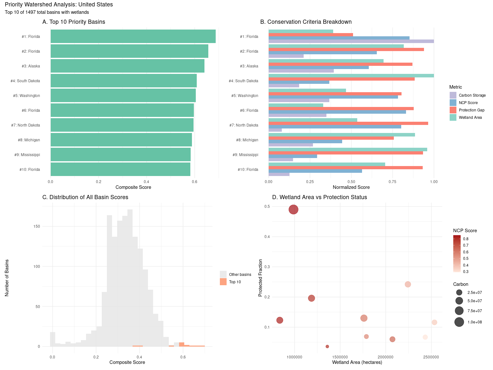

Figure 1: Priority watershed analysis for the United States

</div>

### Canada

``` r
canada_basins <- calculate_basin_metrics('CA')
save_basin_results(canada_basins, 'CA', 'Canada')
```

``` r
canada_basins |>
    head(10) |>
    select(
        basin_id,
        region_name,
        wetland_area_hectares,
        total_carbon,
        protected_fraction,
        avg_ncp_score,
        composite_score
    ) |>
    knitr::kable(digits = 2)
```

<div id="tbl-canada-top10">

Table 2: Top 10 priority basins in Canada

<div class="cell-output-display">

| basin_id | region_name | wetland_area_hectares | total_carbon | protected_fraction | avg_ncp_score | composite_score |
|---:|:---|---:|---:|---:|---:|---:|
| 7060276840 | Ontario | 4645532.5 | 77840679 | 0.06 | 0.11 | 0.75 |
| 7060022280 | Manitoba | 1557604.6 | 67077695 | 0.21 | 0.90 | 0.72 |
| 7060023960 | Ontario | 1589530.8 | 70165077 | 0.00 | 0.57 | 0.70 |
| 7060022280 | Ontario | 954839.2 | 40191987 | 0.00 | 0.76 | 0.62 |
| 8060155650 | Northwest Territories | 2939946.3 | 45848079 | 0.05 | 0.34 | 0.62 |
| 8060231560 | Northwest Territories | 2661236.5 | 63675499 | 0.24 | 0.34 | 0.61 |
| 7060400750 | Ontario | 2321402.2 | 32024168 | 0.09 | 0.60 | 0.60 |
| 7060151610 | Ontario | 1033807.0 | 38739962 | 0.00 | 0.62 | 0.58 |
| 7060055930 | British Columbia | 1464775.0 | 35363397 | 0.17 | 0.73 | 0.58 |
| 7060021690 | Manitoba | 1214599.8 | 43298777 | 0.09 | 0.60 | 0.58 |

</div>

</div>

``` r
plot_country_analysis(canada_basins, "Canada")
```

<div id="fig-canada">

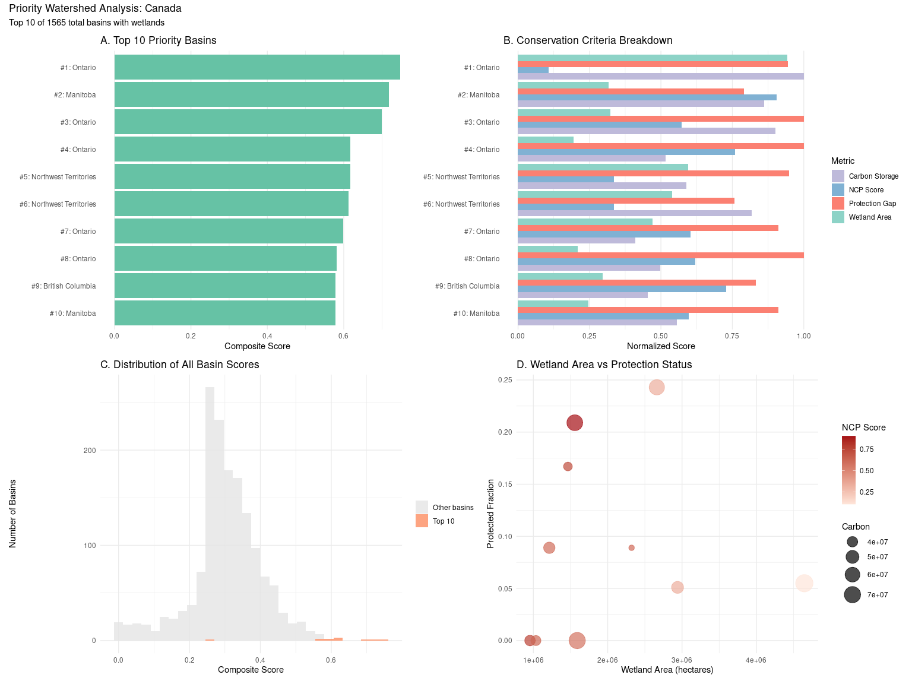

Figure 2: Priority watershed analysis for Canada

</div>

### Mexico

``` r
mexico_basins <- calculate_basin_metrics('MX')
save_basin_results(mexico_basins, 'MX', 'Mexico')
```

``` r
mexico_basins |>
    head(10) |>
    select(
        basin_id,
        region_name,
        wetland_area_hectares,
        total_carbon,
        protected_fraction,
        avg_ncp_score,
        composite_score
    ) |>
    knitr::kable(digits = 2)
```

<div id="tbl-mexico-top10">

Table 3: Top 10 priority basins in Mexico

<div class="cell-output-display">

| basin_id | region_name | wetland_area_hectares | total_carbon | protected_fraction | avg_ncp_score | composite_score |
|---:|:---|---:|---:|---:|---:|---:|
| 7060051220 | Quintana Roo | 2500720.28 | 45117925 | 0.30 | 0.74 | 0.86 |
| 7060051220 | Yucatán | 1287226.52 | 16061017 | 0.19 | 0.76 | 0.61 |
| 7060852120 | Puebla | 22488.49 | 175746 | 0.00 | 1.05 | 0.52 |
| 7060004990 | Guerrero | 122691.31 | 664136 | 0.01 | 1.00 | 0.52 |
| 7060006740 | Durango | 49990.81 | 454582 | 0.00 | 1.03 | 0.51 |
| 7060005740 | Colima | 15852.54 | 137601 | 0.00 | 1.05 | 0.51 |
| 7060794890 | Sinaloa | 13935.49 | 33172 | 0.00 | 1.05 | 0.51 |
| 7060848300 | Oaxaca | 108903.29 | 868167 | 0.02 | 1.01 | 0.51 |
| 7060738830 | Chihuahua | 8036.87 | 41 | 0.01 | 1.05 | 0.51 |
| 7060075070 | Yucatán | 779281.54 | 7545089 | 0.05 | 0.62 | 0.51 |

</div>

</div>

``` r
plot_country_analysis(mexico_basins, "Mexico")
```

<div id="fig-mexico">


Figure 3: Priority watershed analysis for Mexico

</div>

## Asia: China, South Korea, and Thailand

### China

``` r
china_basins <- calculate_basin_metrics('CN')
save_basin_results(china_basins, 'CN', 'China')
```

``` r
china_basins |>
    head(10) |>
    select(
        basin_id,
        region_name,
        wetland_area_hectares,
        total_carbon,
        protected_fraction,
        avg_ncp_score,
        composite_score
    ) |>
    knitr::kable(digits = 2)
```

<div id="tbl-china-top10">

Table 4: Top 10 priority basins in China

<div class="cell-output-display">

| basin_id | region_name | wetland_area_hectares | total_carbon | protected_fraction | avg_ncp_score | composite_score |
|---:|:---|---:|---:|---:|---:|---:|
| 4060154710 | Heilongjiang | 2987356 | 22955778 | 0.09 | 0.16 | 0.77 |
| 4060213920 | Heilongjiang | 2134563 | 17984046 | 0.01 | 0.54 | 0.76 |
| 4060780120 | Sichuan | 1875835 | 11361170 | 0.11 | 0.65 | 0.67 |
| 4060047500 | Hainan Province | 2368960 | 5731888 | 0.00 | 0.61 | 0.66 |
| 4060094870 | Heilongjiang | 1667688 | 12468012 | 0.00 | 0.43 | 0.63 |
| 4060765990 | Sichuan | 2129623 | 4655770 | 0.01 | 0.60 | 0.63 |
| 4060780100 | Sichuan | 1056590 | 6680384 | 0.06 | 0.84 | 0.60 |
| 4060784170 | Tibet | 1177438 | 8057633 | 0.00 | 0.65 | 0.60 |
| 4060239010 | Heilongjiang | 2376776 | 7869675 | 0.00 | 0.23 | 0.59 |
| 4060152570 | Inner Mongolia | 1436314 | 13308502 | 0.00 | 0.27 | 0.58 |

</div>

</div>

``` r
plot_country_analysis(china_basins, "China")
```

<div id="fig-china">

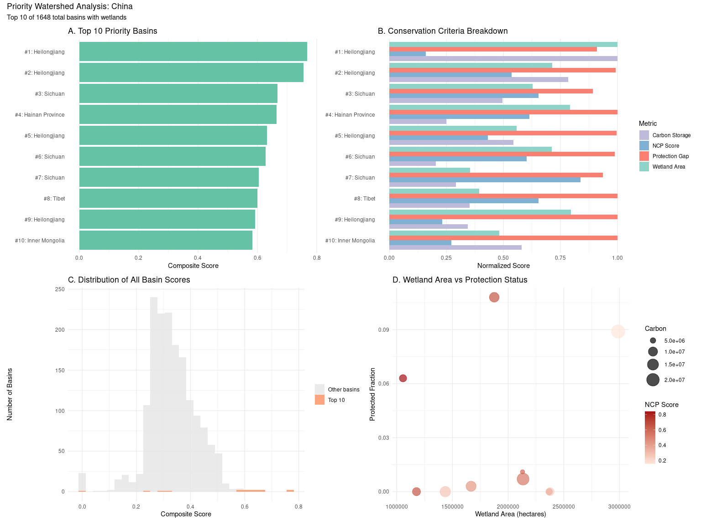

Figure 4: Priority watershed analysis for China

</div>

### South Korea

``` r
korea_basins <- calculate_basin_metrics('KR')
save_basin_results(korea_basins, 'KR', 'South Korea')
```

``` r
korea_basins |>
    head(10) |>
    select(
        basin_id,
        region_name,
        wetland_area_hectares,
        total_carbon,
        protected_fraction,
        avg_ncp_score,
        composite_score
    ) |>
    knitr::kable(digits = 2)
```

<div id="tbl-korea-top10">

Table 5: Top 10 priority basins in South Korea

<div class="cell-output-display">

| basin_id | region_name | wetland_area_hectares | total_carbon | protected_fraction | avg_ncp_score | composite_score |
|---:|:---|---:|---:|---:|---:|---:|
| 4060005050 | Gangwon State | 661898.98 | 2719734 | 0.25 | 0.88 | 0.86 |
| 4060003940 | North Gyeongsang | 829641.01 | 1266503 | 0.09 | 0.18 | 0.64 |
| 4060004110 | South Jeolla | 668018.80 | 1000731 | 0.33 | 0.60 | 0.61 |
| 4060004690 | South Chungcheong | 573493.41 | 368187 | 0.04 | 0.62 | 0.60 |
| 4060004680 | North Chungcheong | 289990.94 | 641605 | 0.27 | 0.81 | 0.53 |
| 4060005050 | Gyeonggi | 417991.02 | 691925 | 0.45 | 0.80 | 0.53 |
| 4060005050 | North Chungcheong | 272147.62 | 846176 | 0.14 | 0.58 | 0.52 |
| 4060003940 | South Gyeongsang | 488110.87 | 696291 | 0.08 | 0.26 | 0.51 |
| 4060003940 | Busan | 2285.72 | 3110 | 0.03 | 1.05 | 0.51 |
| 4060004690 | Seoul | 1843.32 | 507 | 0.04 | 1.05 | 0.50 |

</div>

</div>

``` r
plot_country_analysis(korea_basins, "South Korea")
```

<div id="fig-korea">

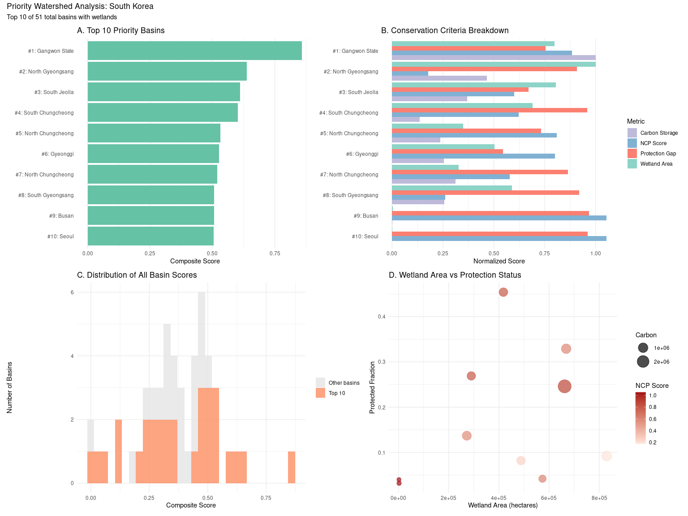

Figure 5: Priority watershed analysis for South Korea

</div>

### Thailand

``` r
thailand_basins <- calculate_basin_metrics('TH')
save_basin_results(thailand_basins, 'TH', 'Thailand')
```

``` r
thailand_basins |>
    head(10) |>
    select(
        basin_id,
        region_name,
        wetland_area_hectares,
        total_carbon,
        protected_fraction,
        avg_ncp_score,
        composite_score
    ) |>
    knitr::kable(digits = 2)
```

<div id="tbl-thailand-top10">

Table 6: Top 10 priority basins in Thailand

<div class="cell-output-display">

| basin_id | region_name | wetland_area_hectares | total_carbon | protected_fraction | avg_ncp_score | composite_score |
|---:|:---|---:|---:|---:|---:|---:|
| 4060021590 | Phang-nga Province | 245235.2 | 4624243 | 0.19 | 0.76 | 0.74 |
| 4060018990 | Nakhon Si Thammarat Province | 505216.9 | 2442041 | 0.15 | 0.76 | 0.74 |
| 4060019420 | Yala Province | 340203.0 | 3516882 | 0.15 | 0.72 | 0.72 |
| 4060018970 | Surat Thani Province | 514728.4 | 3331241 | 0.37 | 0.68 | 0.71 |
| 4060018360 | Kanchanaburi Province | 625769.9 | 3349343 | 0.50 | 0.57 | 0.70 |
| 4060019420 | Narathiwat Province | 371097.0 | 3205501 | 0.20 | 0.71 | 0.70 |
| 4060018230 | Chachoengsao Province | 371391.9 | 518250 | 0.06 | 0.81 | 0.62 |
| 4060021590 | Krabi Province | 185364.2 | 2643575 | 0.12 | 0.69 | 0.61 |
| 4060021590 | Ranong Province | 171354.9 | 2801321 | 0.36 | 0.90 | 0.61 |
| 4060018230 | Prachin Buri Province | 330101.6 | 1368072 | 0.14 | 0.72 | 0.60 |

</div>

</div>

``` r
plot_country_analysis(thailand_basins, "Thailand")
```

<div id="fig-thailand">

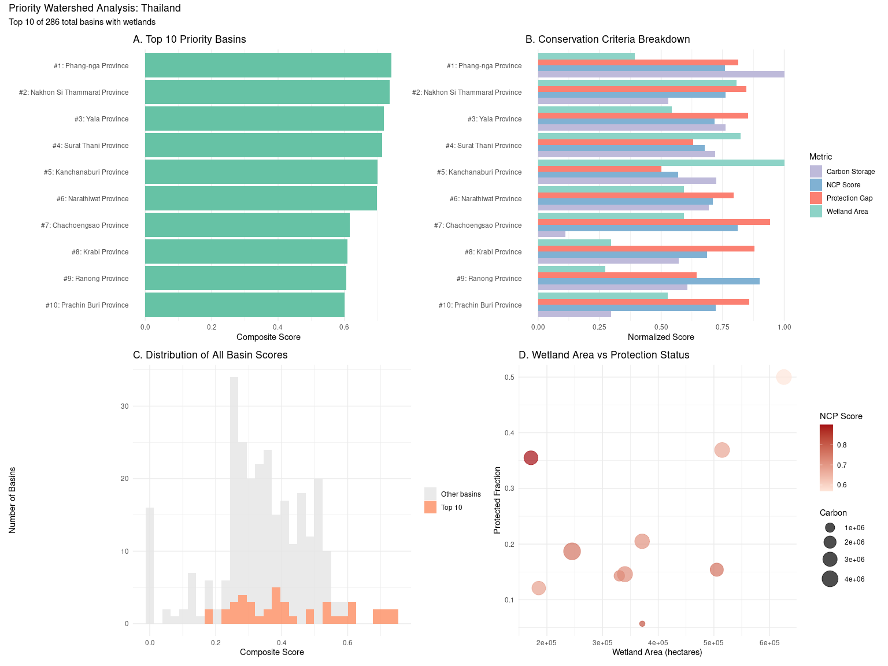

Figure 6: Priority watershed analysis for Thailand

</div>

## Europe: United Kingdom, France, and Spain

### United Kingdom

``` r
uk_basins <- calculate_basin_metrics('GB')
save_basin_results(uk_basins, 'GB', 'United Kingdom')
```

``` r
uk_basins |>
    head(10) |>
    select(
        basin_id,
        region_name,
        wetland_area_hectares,
        total_carbon,
        protected_fraction,
        avg_ncp_score,
        composite_score
    ) |>
    knitr::kable(digits = 2)
```

<div id="tbl-uk-top10">

Table 7: Top 10 priority basins in the United Kingdom

<div class="cell-output-display">

| basin_id | region_name | wetland_area_hectares | total_carbon | protected_fraction | avg_ncp_score | composite_score |
|---:|:---|---:|---:|---:|---:|---:|
| 2060051160 | Scotland | 3736112.67 | 54955700 | 0.38 | 0.70 | 0.83 |
| 2060050790 | Scotland | 972166.44 | 20513463 | 0.12 | 0.75 | 0.56 |
| 2060049690 | Wales | 1164535.21 | 25987594 | 0.41 | 0.69 | 0.52 |
| 2060053240 | England | 673991.16 | 20112092 | 0.42 | 0.90 | 0.51 |
| 2060050420 | England | 845862.22 | 24518796 | 0.57 | 0.92 | 0.51 |
| 2060052960 | England | 842912.91 | 20521267 | 0.39 | 0.77 | 0.49 |
| 2060055600 | Northern Ireland | 487004.88 | 13689548 | 0.23 | 0.78 | 0.48 |
| 2060055310 | Northern Ireland | 204387.21 | 6189826 | 0.13 | 0.85 | 0.47 |
| 2060051150 | Scotland | 323981.75 | 7635554 | 0.07 | 0.70 | 0.46 |
| 2060050790 | England | 38193.57 | 852933 | 0.07 | 0.90 | 0.46 |

</div>

</div>

``` r
plot_country_analysis(uk_basins, "United Kingdom")
```

<div id="fig-uk">

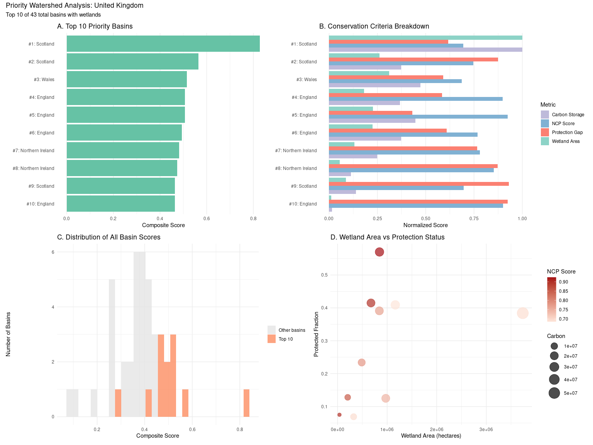

Figure 7: Priority watershed analysis for the United Kingdom

</div>

### France

``` r
france_basins <- calculate_basin_metrics('FR')
save_basin_results(france_basins, 'FR', 'France')
```

``` r
france_basins |>
    head(10) |>
    select(
        basin_id,
        region_name,
        wetland_area_hectares,
        total_carbon,
        protected_fraction,
        avg_ncp_score,
        composite_score
    ) |>
    knitr::kable(digits = 2)
```

<div id="tbl-france-top10">

Table 8: Top 10 priority basins in France

<div class="cell-output-display">

| basin_id | region_name | wetland_area_hectares | total_carbon | protected_fraction | avg_ncp_score | composite_score |
|---:|:---|---:|---:|---:|---:|---:|
| 2060552470 | Auvergne-Rhône-Alpes | 523502.6 | 3630486 | 0.34 | 0.54 | 0.66 |
| 2060536370 | Auvergne-Rhône-Alpes | 570249.2 | 3036506 | 0.30 | 0.50 | 0.65 |
| 2060021230 | Normandy | 262488.6 | 5501654 | 0.38 | 0.58 | 0.65 |
| 2060021230 | Brittany | 684682.4 | 2205511 | 0.21 | 0.38 | 0.64 |
| 2060420240 | Grand Est | 544295.2 | 3653752 | 0.29 | 0.23 | 0.60 |
| 2060502920 | Nouvelle-Aquitaine | 557862.1 | 2238149 | 0.16 | 0.32 | 0.60 |
| 2060569180 | Occitania | 418802.1 | 1736915 | 0.28 | 0.62 | 0.57 |
| 2060021030 | Pays de la Loire | 390783.6 | 1268552 | 0.13 | 0.55 | 0.56 |
| 2060497340 | Pays de la Loire | 450064.8 | 2084031 | 0.11 | 0.26 | 0.55 |
| 2060510690 | Bourgogne – Franche-Comté | 333567.0 | 3552314 | 0.39 | 0.45 | 0.55 |

</div>

</div>

``` r
plot_country_analysis(france_basins, "France")
```

<div id="fig-france">

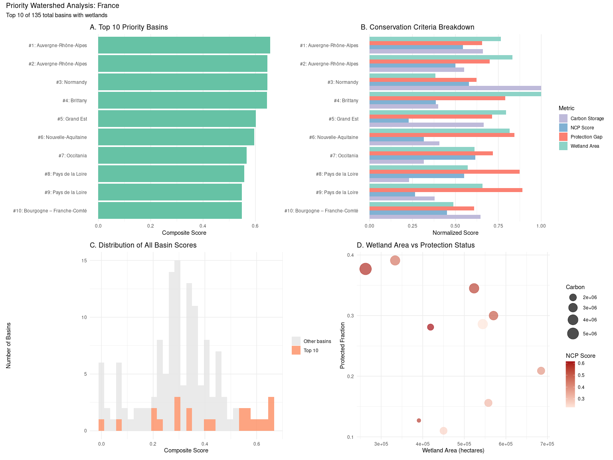

Figure 8: Priority watershed analysis for France

</div>

### Spain

``` r
spain_basins <- calculate_basin_metrics('ES')
save_basin_results(spain_basins, 'ES', 'Spain')
```

``` r
spain_basins |>
    head(10) |>
    select(
        basin_id,
        region_name,
        wetland_area_hectares,
        total_carbon,
        protected_fraction,
        avg_ncp_score,
        composite_score
    ) |>
    knitr::kable(digits = 2)
```

<div id="tbl-spain-top10">

Table 9: Top 10 priority basins in Spain

<div class="cell-output-display">

| basin_id | region_name | wetland_area_hectares | total_carbon | protected_fraction | avg_ncp_score | composite_score |
|---:|:---|---:|---:|---:|---:|---:|
| 2060018360 | Andalusia | 814230.87 | 6299718 | 0.23 | 0.85 | 0.91 |
| 2060615620 | Aragon | 330765.16 | 2286648 | 0.28 | 0.67 | 0.54 |
| 2060609250 | Aragon | 172239.73 | 1230820 | 0.24 | 0.97 | 0.53 |
| 2060018240 | Andalusia | 378396.52 | 1758187 | 0.24 | 0.56 | 0.52 |
| 2060613120 | Castile and León | 366894.21 | 1091214 | 0.18 | 0.53 | 0.49 |
| 2060017700 | Andalusia | 392995.61 | 903264 | 0.23 | 0.55 | 0.49 |
| 2060615620 | Catalonia | 250986.31 | 3179844 | 0.36 | 0.47 | 0.48 |
| 2060689480 | Castile-La Mancha | 1032.26 | 7840 | 0.14 | 1.05 | 0.48 |
| 2060019420 | Galicia | 2728.11 | 14942 | 0.11 | 1.00 | 0.48 |
| 2060598480 | Aragon | 102046.14 | 976468 | 0.28 | 0.89 | 0.47 |

</div>

</div>

``` r
plot_country_analysis(spain_basins, "Spain")
```

<div id="fig-spain">

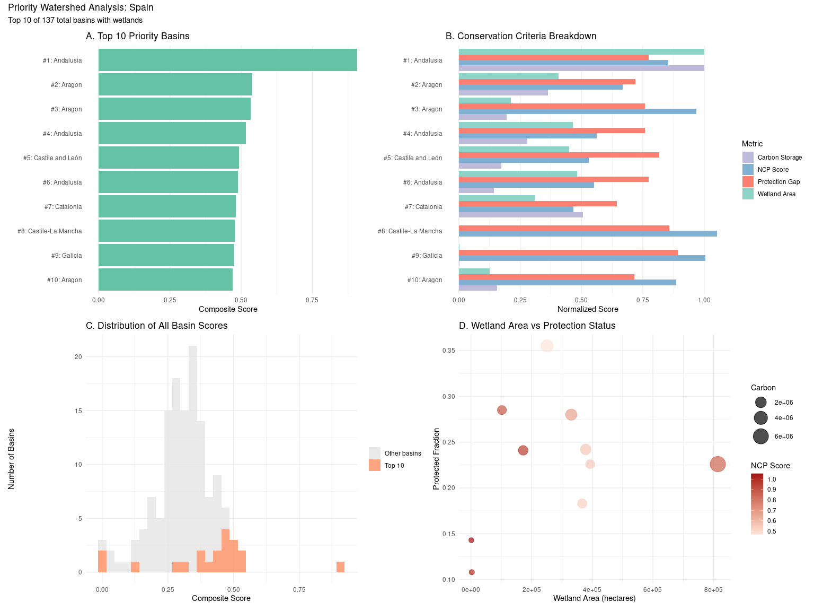

Figure 9: Priority watershed analysis for Spain

</div>

## South America: Brazil and Chile

### Brazil

``` r
brazil_basins <- calculate_basin_metrics('BR')
save_basin_results(brazil_basins, 'BR', 'Brazil')
```

``` r
brazil_basins |>
    head(10) |>
    select(
        basin_id,
        region_name,
        wetland_area_hectares,
        total_carbon,
        protected_fraction,
        avg_ncp_score,
        composite_score
    ) |>
    knitr::kable(digits = 2)
```

<div id="tbl-brazil-top10">

Table 10: Top 10 priority basins in Brazil

<div class="cell-output-display">

| basin_id | region_name | wetland_area_hectares | total_carbon | protected_fraction | avg_ncp_score | composite_score |
|---:|:---|---:|---:|---:|---:|---:|
| 6060294360 | Amazonas | 4883173 | 141682590 | 0.57 | 0.84 | 0.73 |
| 6060269510 | Amazonas | 4911339 | 148601298 | 0.61 | 0.70 | 0.70 |
| 6060287830 | Amazonas | 3724537 | 181332932 | 0.62 | 0.78 | 0.70 |
| 6060286190 | Amazonas | 4049698 | 108787314 | 0.47 | 0.82 | 0.67 |
| 6060305980 | Amazonas | 2601808 | 69408761 | 0.00 | 0.77 | 0.66 |
| 6060267240 | Amazonas | 3240923 | 120317611 | 0.59 | 0.86 | 0.63 |
| 6060280410 | Amazonas | 1969918 | 51386243 | 0.05 | 0.83 | 0.61 |
| 6060360870 | Amazonas | 3137919 | 88687485 | 0.33 | 0.69 | 0.60 |
| 6060247260 | Amazonas | 2710932 | 210340274 | 0.96 | 0.79 | 0.59 |
| 6060692440 | Mato Grosso do Sul | 2165531 | 31779711 | 0.02 | 0.74 | 0.58 |

</div>

</div>

``` r
plot_country_analysis(brazil_basins, "Brazil")
```

<div id="fig-brazil">

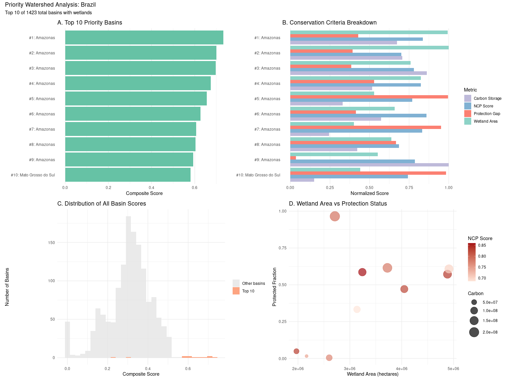

Figure 10: Priority watershed analysis for Brazil

</div>

### Chile

``` r
chile_basins <- calculate_basin_metrics('CL')
save_basin_results(chile_basins, 'CL', 'Chile')
```

``` r
chile_basins |>
    head(10) |>
    select(
        basin_id,
        region_name,
        wetland_area_hectares,
        total_carbon,
        protected_fraction,
        avg_ncp_score,
        composite_score
    ) |>
    knitr::kable(digits = 2)
```

<div id="tbl-chile-top10">

Table 11: Top 10 priority basins in Chile

<div class="cell-output-display">

| basin_id | region_name | wetland_area_hectares | total_carbon | protected_fraction | avg_ncp_score | composite_score |
|---:|:---|---:|---:|---:|---:|---:|
| 6060036450 | Magallanes and Chilean Antarctica Region | 2508167.29 | 50305952 | 0.29 | 0.63 | 0.84 |
| 6060024060 | Aysen del General Carlos Ibanez del Campo Region | 1866028.69 | 40006604 | 0.65 | 0.44 | 0.58 |
| 6060025140 | Aysen del General Carlos Ibanez del Campo Region | 1281032.97 | 29289888 | 0.36 | 0.58 | 0.58 |
| 6060022920 | Magallanes and Chilean Antarctica Region | 1907540.23 | 44721318 | 0.94 | 0.56 | 0.57 |
| 6060039730 | Los Lagos Region | 739834.51 | 11770384 | 0.06 | 0.77 | 0.56 |
| 6060025130 | Aysen del General Carlos Ibanez del Campo Region | 1090360.05 | 22264746 | 0.15 | 0.48 | 0.55 |
| 6060021950 | Magallanes and Chilean Antarctica Region | 1602212.87 | 33232005 | 0.73 | 0.56 | 0.53 |
| 6060026390 | Los Ríos | 26322.60 | 337804 | 0.00 | 1.05 | 0.52 |
| 6060026390 | Araucania Region | 31852.55 | 438122 | 0.00 | 1.02 | 0.51 |
| 6060038660 | Magallanes and Chilean Antarctica Region | 1210691.92 | 41324289 | 0.90 | 0.63 | 0.51 |

</div>

</div>

``` r
plot_country_analysis(chile_basins, "Chile")
```

<div id="fig-chile">


Figure 11: Priority watershed analysis for Chile

</div>

## Australia

``` r
australia_basins <- calculate_basin_metrics('AU')
save_basin_results(australia_basins, 'AU', 'Australia')
```

``` r
australia_basins |>
    head(10) |>
    select(
        basin_id,
        region_name,
        wetland_area_hectares,
        total_carbon,
        protected_fraction,
        avg_ncp_score,
        composite_score
    ) |>
    knitr::kable(digits = 2)
```

<div id="tbl-australia-top10">

Table 12: Top 10 priority basins in Australia

<div class="cell-output-display">

| basin_id | region_name | wetland_area_hectares | total_carbon | protected_fraction | avg_ncp_score | composite_score |
|---:|:---|---:|---:|---:|---:|---:|
| 5060077790 | Tasmania | 2510379.27 | 95835397 | 0.51 | 0.82 | 0.83 |
| 5060456070 | South Australia | 577917.37 | 2485184 | 0.02 | 0.98 | 0.55 |
| 5060049720 | Queensland | 1511521.58 | 20521613 | 0.35 | 0.67 | 0.54 |
| 5060352950 | Western Australia | 73364.10 | 278040 | 0.00 | 1.05 | 0.52 |
| 5060405540 | Western Australia | 6857.15 | 0 | 0.01 | 1.05 | 0.51 |
| 5060284090 | Northern Territory | 4571.43 | 33459 | 0.02 | 1.05 | 0.51 |
| 5060590940 | New South Wales | 5751.16 | 67171 | 0.01 | 1.04 | 0.51 |
| 5060373470 | Western Australia | 4202.77 | 641 | 0.02 | 1.05 | 0.51 |
| 5060591290 | New South Wales | 24921.67 | 261349 | 0.00 | 1.02 | 0.51 |
| 5060057550 | Western Australia | 7963.14 | 55137 | 0.03 | 1.05 | 0.51 |

</div>

</div>

``` r
plot_country_analysis(australia_basins, "Australia")
```

<div id="fig-australia">

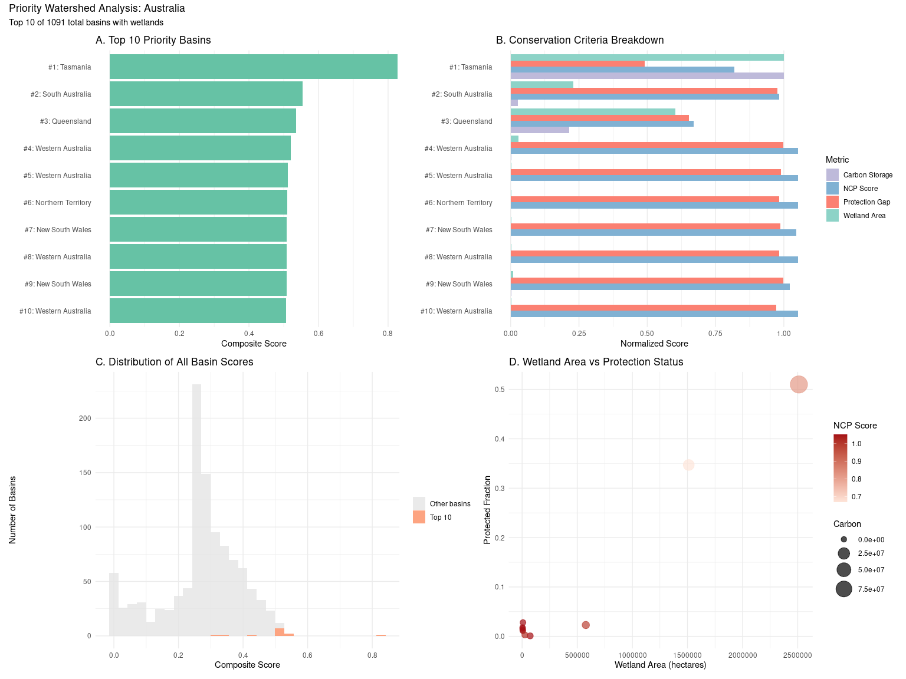

Figure 12: Priority watershed analysis for Australia

</div>

## India

``` r
india_basins <- calculate_basin_metrics('IN')
save_basin_results(india_basins, 'IN', 'India')
```

``` r
india_basins |>
    head(10) |>
    select(
        basin_id,
        region_name,
        wetland_area_hectares,
        total_carbon,
        protected_fraction,
        avg_ncp_score,
        composite_score
    ) |>
    knitr::kable(digits = 2)
```

<div id="tbl-india-top10">

Table 13: Top 10 priority basins in India

<div class="cell-output-display">

| basin_id | region_name | wetland_area_hectares | total_carbon | protected_fraction | avg_ncp_score | composite_score |
|---:|:---|---:|---:|---:|---:|---:|
| 4060838850 | Arunachal Pradesh | 1023558.2 | 16138869 | 0.00 | 0.80 | 0.78 |
| 4060838850 | South Tibet | 988240.2 | 15930818 | 0.00 | 0.80 | 0.78 |
| 4060048470 | Andaman and Nicobar Islands | 519742.2 | 14082290 | 0.00 | 0.91 | 0.74 |
| 4060949680 | Meghalaya | 758046.5 | 8537129 | 0.00 | 0.93 | 0.68 |
| 4060835610 | Arunachal Pradesh | 835097.2 | 13006787 | 0.00 | 0.63 | 0.68 |
| 4060835610 | South Tibet | 786138.7 | 12501877 | 0.00 | 0.61 | 0.66 |
| 4060032880 | Gujarat | 1669014.8 | 1348407 | 0.00 | 0.76 | 0.60 |
| 4060029870 | Karnataka | 1233770.3 | 5971331 | 0.04 | 0.64 | 0.59 |
| 4060836200 | Arunachal Pradesh | 514802.1 | 7857501 | 0.00 | 0.67 | 0.58 |
| 4060836200 | South Tibet | 514802.1 | 7857501 | 0.00 | 0.67 | 0.58 |

</div>

</div>

``` r
plot_country_analysis(india_basins, "India")
```

<div id="fig-india">

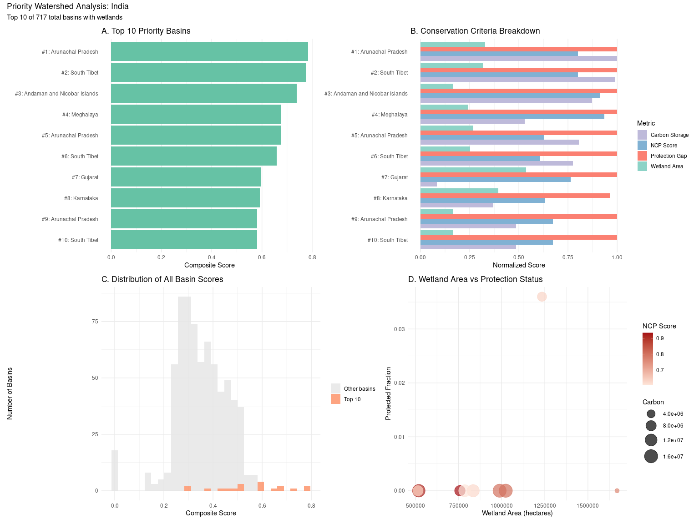

Figure 13: Priority watershed analysis for India

</div>

## Summary: Combined Results

``` r
all_results <- bind_rows(
    us_basins |> head(10) |> mutate(country = "United States", country_code = "US"),
    canada_basins |> head(10) |> mutate(country = "Canada", country_code = "CA"),
    mexico_basins |> head(10) |> mutate(country = "Mexico", country_code = "MX"),
    china_basins |> head(10) |> mutate(country = "China", country_code = "CN"),
    korea_basins |> head(10) |> mutate(country = "South Korea", country_code = "KR"),
    thailand_basins |> head(10) |> mutate(country = "Thailand", country_code = "TH"),
    uk_basins |> head(10) |> mutate(country = "United Kingdom", country_code = "GB"),
    france_basins |> head(10) |> mutate(country = "France", country_code = "FR"),
    spain_basins |> head(10) |> mutate(country = "Spain", country_code = "ES"),
    brazil_basins |> head(10) |> mutate(country = "Brazil", country_code = "BR"),
    chile_basins |> head(10) |> mutate(country = "Chile", country_code = "CL"),
    australia_basins |> head(10) |> mutate(country = "Australia", country_code = "AU"),
    india_basins |> head(10) |> mutate(country = "India", country_code = "IN")
)

write.csv(
    all_results,
    'priority_hydrobasins_top10_summary.csv',
    row.names = FALSE
)
```

``` r
all_results |>
    select(
        country,
        basin_id,
        region_name,
        wetland_area_hectares,
        total_carbon,
        protected_fraction,
        avg_ncp_score,
        composite_score
    ) |>
    knitr::kable(digits = 2)
```

<div id="tbl-summary">

Table 14: Top 10 priority basins per country

<div class="cell-output-display">

| country | basin_id | region_name | wetland_area_hectares | total_carbon | protected_fraction | avg_ncp_score | composite_score |
|:---|---:|:---|---:|---:|---:|---:|---:|
| United States | 7060044360 | Florida | 988240.18 | 104702831 | 0.49 | 0.85 | 0.69 |
| United States | 7060043860 | Florida | 2073733.87 | 22062072 | 0.06 | 0.65 | 0.66 |
| United States | 7060057980 | Alaska | 1760664.57 | 41228180 | 0.13 | 0.60 | 0.64 |
| United States | 7060468870 | South Dakota | 2534711.08 | 19305736 | 0.12 | 0.37 | 0.61 |
| United States | 7060015100 | Washington | 1185843.98 | 38421206 | 0.20 | 0.78 | 0.60 |
| United States | 7060044350 | Florida | 837604.15 | 36521213 | 0.12 | 0.83 | 0.60 |
| United States | 7060356500 | North Dakota | 1359263.43 | 8219300 | 0.04 | 0.80 | 0.60 |
| United States | 7060392650 | Michigan | 2242803.09 | 28089297 | 0.24 | 0.44 | 0.59 |
| United States | 7060715640 | Mississippi | 2433033.61 | 15481275 | 0.07 | 0.29 | 0.58 |
| United States | 7060044770 | Florida | 1787724.49 | 13163445 | 0.07 | 0.56 | 0.58 |
| Canada | 7060276840 | Ontario | 4645532.53 | 77840679 | 0.06 | 0.11 | 0.75 |
| Canada | 7060022280 | Manitoba | 1557604.55 | 67077695 | 0.21 | 0.90 | 0.72 |
| Canada | 7060023960 | Ontario | 1589530.84 | 70165077 | 0.00 | 0.57 | 0.70 |
| Canada | 7060022280 | Ontario | 954839.24 | 40191987 | 0.00 | 0.76 | 0.62 |
| Canada | 8060155650 | Northwest Territories | 2939946.33 | 45848079 | 0.05 | 0.34 | 0.62 |
| Canada | 8060231560 | Northwest Territories | 2661236.50 | 63675499 | 0.24 | 0.34 | 0.61 |
| Canada | 7060400750 | Ontario | 2321402.21 | 32024168 | 0.09 | 0.60 | 0.60 |
| Canada | 7060151610 | Ontario | 1033807.03 | 38739962 | 0.00 | 0.62 | 0.58 |
| Canada | 7060055930 | British Columbia | 1464775.01 | 35363397 | 0.17 | 0.73 | 0.58 |
| Canada | 7060021690 | Manitoba | 1214599.75 | 43298777 | 0.09 | 0.60 | 0.58 |
| Mexico | 7060051220 | Quintana Roo | 2500720.28 | 45117925 | 0.30 | 0.74 | 0.86 |
| Mexico | 7060051220 | Yucatán | 1287226.52 | 16061017 | 0.19 | 0.76 | 0.61 |
| Mexico | 7060852120 | Puebla | 22488.49 | 175746 | 0.00 | 1.05 | 0.52 |
| Mexico | 7060004990 | Guerrero | 122691.31 | 664136 | 0.01 | 1.00 | 0.52 |
| Mexico | 7060006740 | Durango | 49990.81 | 454582 | 0.00 | 1.03 | 0.51 |
| Mexico | 7060005740 | Colima | 15852.54 | 137601 | 0.00 | 1.05 | 0.51 |
| Mexico | 7060794890 | Sinaloa | 13935.49 | 33172 | 0.00 | 1.05 | 0.51 |
| Mexico | 7060848300 | Oaxaca | 108903.29 | 868167 | 0.02 | 1.01 | 0.51 |
| Mexico | 7060738830 | Chihuahua | 8036.87 | 41 | 0.01 | 1.05 | 0.51 |
| Mexico | 7060075070 | Yucatán | 779281.54 | 7545089 | 0.05 | 0.62 | 0.51 |
| China | 4060154710 | Heilongjiang | 2987356.50 | 22955778 | 0.09 | 0.16 | 0.77 |
| China | 4060213920 | Heilongjiang | 2134563.40 | 17984046 | 0.01 | 0.54 | 0.76 |
| China | 4060780120 | Sichuan | 1875835.14 | 11361170 | 0.11 | 0.65 | 0.67 |
| China | 4060047500 | Hainan Province | 2368959.84 | 5731888 | 0.00 | 0.61 | 0.66 |
| China | 4060094870 | Heilongjiang | 1667687.56 | 12468012 | 0.00 | 0.43 | 0.63 |
| China | 4060765990 | Sichuan | 2129623.30 | 4655770 | 0.01 | 0.60 | 0.63 |
| China | 4060780100 | Sichuan | 1056590.45 | 6680384 | 0.06 | 0.84 | 0.60 |
| China | 4060784170 | Tibet | 1177438.44 | 8057633 | 0.00 | 0.65 | 0.60 |
| China | 4060239010 | Heilongjiang | 2376775.51 | 7869675 | 0.00 | 0.23 | 0.59 |
| China | 4060152570 | Inner Mongolia | 1436314.16 | 13308502 | 0.00 | 0.27 | 0.58 |
| South Korea | 4060005050 | Gangwon State | 661898.98 | 2719734 | 0.25 | 0.88 | 0.86 |
| South Korea | 4060003940 | North Gyeongsang | 829641.01 | 1266503 | 0.09 | 0.18 | 0.64 |
| South Korea | 4060004110 | South Jeolla | 668018.80 | 1000731 | 0.33 | 0.60 | 0.61 |
| South Korea | 4060004690 | South Chungcheong | 573493.41 | 368187 | 0.04 | 0.62 | 0.60 |
| South Korea | 4060004680 | North Chungcheong | 289990.94 | 641605 | 0.27 | 0.81 | 0.53 |
| South Korea | 4060005050 | Gyeonggi | 417991.02 | 691925 | 0.45 | 0.80 | 0.53 |
| South Korea | 4060005050 | North Chungcheong | 272147.62 | 846176 | 0.14 | 0.58 | 0.52 |
| South Korea | 4060003940 | South Gyeongsang | 488110.87 | 696291 | 0.08 | 0.26 | 0.51 |
| South Korea | 4060003940 | Busan | 2285.72 | 3110 | 0.03 | 1.05 | 0.51 |
| South Korea | 4060004690 | Seoul | 1843.32 | 507 | 0.04 | 1.05 | 0.50 |
| Thailand | 4060021590 | Phang-nga Province | 245235.16 | 4624243 | 0.19 | 0.76 | 0.74 |
| Thailand | 4060018990 | Nakhon Si Thammarat Province | 505216.87 | 2442041 | 0.15 | 0.76 | 0.74 |
| Thailand | 4060019420 | Yala Province | 340202.95 | 3516882 | 0.15 | 0.72 | 0.72 |
| Thailand | 4060018970 | Surat Thani Province | 514728.40 | 3331241 | 0.37 | 0.68 | 0.71 |
| Thailand | 4060018360 | Kanchanaburi Province | 625769.93 | 3349343 | 0.50 | 0.57 | 0.70 |
| Thailand | 4060019420 | Narathiwat Province | 371096.98 | 3205501 | 0.20 | 0.71 | 0.70 |
| Thailand | 4060018230 | Chachoengsao Province | 371391.91 | 518250 | 0.06 | 0.81 | 0.62 |
| Thailand | 4060021590 | Krabi Province | 185364.16 | 2643575 | 0.12 | 0.69 | 0.61 |
| Thailand | 4060021590 | Ranong Province | 171354.93 | 2801321 | 0.36 | 0.90 | 0.61 |
| Thailand | 4060018230 | Prachin Buri Province | 330101.57 | 1368072 | 0.14 | 0.72 | 0.60 |
| United Kingdom | 2060051160 | Scotland | 3736112.67 | 54955700 | 0.38 | 0.70 | 0.83 |
| United Kingdom | 2060050790 | Scotland | 972166.44 | 20513463 | 0.12 | 0.75 | 0.56 |
| United Kingdom | 2060049690 | Wales | 1164535.21 | 25987594 | 0.41 | 0.69 | 0.52 |
| United Kingdom | 2060053240 | England | 673991.16 | 20112092 | 0.42 | 0.90 | 0.51 |
| United Kingdom | 2060050420 | England | 845862.22 | 24518796 | 0.57 | 0.92 | 0.51 |
| United Kingdom | 2060052960 | England | 842912.91 | 20521267 | 0.39 | 0.77 | 0.49 |
| United Kingdom | 2060055600 | Northern Ireland | 487004.88 | 13689548 | 0.23 | 0.78 | 0.48 |
| United Kingdom | 2060055310 | Northern Ireland | 204387.21 | 6189826 | 0.13 | 0.85 | 0.47 |
| United Kingdom | 2060051150 | Scotland | 323981.75 | 7635554 | 0.07 | 0.70 | 0.46 |
| United Kingdom | 2060050790 | England | 38193.57 | 852933 | 0.07 | 0.90 | 0.46 |
| France | 2060552470 | Auvergne-Rhône-Alpes | 523502.59 | 3630486 | 0.34 | 0.54 | 0.66 |
| France | 2060536370 | Auvergne-Rhône-Alpes | 570249.16 | 3036506 | 0.30 | 0.50 | 0.65 |
| France | 2060021230 | Normandy | 262488.62 | 5501654 | 0.38 | 0.58 | 0.65 |
| France | 2060021230 | Brittany | 684682.41 | 2205511 | 0.21 | 0.38 | 0.64 |
| France | 2060420240 | Grand Est | 544295.23 | 3653752 | 0.29 | 0.23 | 0.60 |
| France | 2060502920 | Nouvelle-Aquitaine | 557862.06 | 2238149 | 0.16 | 0.32 | 0.60 |
| France | 2060569180 | Occitania | 418802.08 | 1736915 | 0.28 | 0.62 | 0.57 |
| France | 2060021030 | Pays de la Loire | 390783.63 | 1268552 | 0.13 | 0.55 | 0.56 |
| France | 2060497340 | Pays de la Loire | 450064.77 | 2084031 | 0.11 | 0.26 | 0.55 |
| France | 2060510690 | Bourgogne – Franche-Comté | 333567.01 | 3552314 | 0.39 | 0.45 | 0.55 |
| Spain | 2060018360 | Andalusia | 814230.87 | 6299718 | 0.23 | 0.85 | 0.91 |
| Spain | 2060615620 | Aragon | 330765.16 | 2286648 | 0.28 | 0.67 | 0.54 |
| Spain | 2060609250 | Aragon | 172239.73 | 1230820 | 0.24 | 0.97 | 0.53 |
| Spain | 2060018240 | Andalusia | 378396.52 | 1758187 | 0.24 | 0.56 | 0.52 |
| Spain | 2060613120 | Castile and León | 366894.21 | 1091214 | 0.18 | 0.53 | 0.49 |
| Spain | 2060017700 | Andalusia | 392995.61 | 903264 | 0.23 | 0.55 | 0.49 |
| Spain | 2060615620 | Catalonia | 250986.31 | 3179844 | 0.36 | 0.47 | 0.48 |
| Spain | 2060689480 | Castile-La Mancha | 1032.26 | 7840 | 0.14 | 1.05 | 0.48 |
| Spain | 2060019420 | Galicia | 2728.11 | 14942 | 0.11 | 1.00 | 0.48 |
| Spain | 2060598480 | Aragon | 102046.14 | 976468 | 0.28 | 0.89 | 0.47 |
| Brazil | 6060294360 | Amazonas | 4883173.22 | 141682590 | 0.57 | 0.84 | 0.73 |
| Brazil | 6060269510 | Amazonas | 4911339.13 | 148601298 | 0.61 | 0.70 | 0.70 |
| Brazil | 6060287830 | Amazonas | 3724536.63 | 181332932 | 0.62 | 0.78 | 0.70 |
| Brazil | 6060286190 | Amazonas | 4049698.10 | 108787314 | 0.47 | 0.82 | 0.67 |
| Brazil | 6060305980 | Amazonas | 2601807.90 | 69408761 | 0.00 | 0.77 | 0.66 |
| Brazil | 6060267240 | Amazonas | 3240923.46 | 120317611 | 0.59 | 0.86 | 0.63 |
| Brazil | 6060280410 | Amazonas | 1969918.14 | 51386243 | 0.05 | 0.83 | 0.61 |
| Brazil | 6060360870 | Amazonas | 3137918.79 | 88687485 | 0.33 | 0.69 | 0.60 |
| Brazil | 6060247260 | Amazonas | 2710932.38 | 210340274 | 0.96 | 0.79 | 0.59 |
| Brazil | 6060692440 | Mato Grosso do Sul | 2165531.16 | 31779711 | 0.02 | 0.74 | 0.58 |
| Chile | 6060036450 | Magallanes and Chilean Antarctica Region | 2508167.29 | 50305952 | 0.29 | 0.63 | 0.84 |
| Chile | 6060024060 | Aysen del General Carlos Ibanez del Campo Region | 1866028.69 | 40006604 | 0.65 | 0.44 | 0.58 |
| Chile | 6060025140 | Aysen del General Carlos Ibanez del Campo Region | 1281032.97 | 29289888 | 0.36 | 0.58 | 0.58 |
| Chile | 6060022920 | Magallanes and Chilean Antarctica Region | 1907540.23 | 44721318 | 0.94 | 0.56 | 0.57 |
| Chile | 6060039730 | Los Lagos Region | 739834.51 | 11770384 | 0.06 | 0.77 | 0.56 |
| Chile | 6060025130 | Aysen del General Carlos Ibanez del Campo Region | 1090360.05 | 22264746 | 0.15 | 0.48 | 0.55 |
| Chile | 6060021950 | Magallanes and Chilean Antarctica Region | 1602212.87 | 33232005 | 0.73 | 0.56 | 0.53 |
| Chile | 6060026390 | Los Ríos | 26322.60 | 337804 | 0.00 | 1.05 | 0.52 |
| Chile | 6060026390 | Araucania Region | 31852.55 | 438122 | 0.00 | 1.02 | 0.51 |
| Chile | 6060038660 | Magallanes and Chilean Antarctica Region | 1210691.92 | 41324289 | 0.90 | 0.63 | 0.51 |
| Australia | 5060077790 | Tasmania | 2510379.27 | 95835397 | 0.51 | 0.82 | 0.83 |
| Australia | 5060456070 | South Australia | 577917.37 | 2485184 | 0.02 | 0.98 | 0.55 |
| Australia | 5060049720 | Queensland | 1511521.58 | 20521613 | 0.35 | 0.67 | 0.54 |
| Australia | 5060352950 | Western Australia | 73364.10 | 278040 | 0.00 | 1.05 | 0.52 |
| Australia | 5060405540 | Western Australia | 6857.15 | 0 | 0.01 | 1.05 | 0.51 |
| Australia | 5060284090 | Northern Territory | 4571.43 | 33459 | 0.02 | 1.05 | 0.51 |
| Australia | 5060590940 | New South Wales | 5751.16 | 67171 | 0.01 | 1.04 | 0.51 |
| Australia | 5060373470 | Western Australia | 4202.77 | 641 | 0.02 | 1.05 | 0.51 |
| Australia | 5060591290 | New South Wales | 24921.67 | 261349 | 0.00 | 1.02 | 0.51 |
| Australia | 5060057550 | Western Australia | 7963.14 | 55137 | 0.03 | 1.05 | 0.51 |
| India | 4060838850 | Arunachal Pradesh | 1023558.17 | 16138869 | 0.00 | 0.80 | 0.78 |
| India | 4060838850 | South Tibet | 988240.18 | 15930818 | 0.00 | 0.80 | 0.78 |
| India | 4060048470 | Andaman and Nicobar Islands | 519742.22 | 14082290 | 0.00 | 0.91 | 0.74 |
| India | 4060949680 | Meghalaya | 758046.50 | 8537129 | 0.00 | 0.93 | 0.68 |
| India | 4060835610 | Arunachal Pradesh | 835097.24 | 13006787 | 0.00 | 0.63 | 0.68 |
| India | 4060835610 | South Tibet | 786138.68 | 12501877 | 0.00 | 0.61 | 0.66 |
| India | 4060032880 | Gujarat | 1669014.75 | 1348407 | 0.00 | 0.76 | 0.60 |
| India | 4060029870 | Karnataka | 1233770.27 | 5971331 | 0.04 | 0.64 | 0.59 |
| India | 4060836200 | Arunachal Pradesh | 514802.13 | 7857501 | 0.00 | 0.67 | 0.58 |
| India | 4060836200 | South Tibet | 514802.13 | 7857501 | 0.00 | 0.67 | 0.58 |

</div>

</div>

## Cross-Country Overview

``` r
all_results |>
    ggplot(aes(
        x = reorder(country, composite_score, FUN = median),
        y = composite_score
    )) +
    geom_boxplot(fill = "#66c2a5", alpha = 0.7) +
    geom_jitter(width = 0.2, alpha = 0.5, size = 2) +
    coord_flip() +
    labs(
        title = "Distribution of Composite Scores: Top 10 Basins Per Country",
        subtitle = "Scores normalized within each country - not directly comparable across countries",
        x = NULL,
        y = "Composite Score (country-specific)"
    ) +
    theme_minimal() +
    theme(panel.grid.major.y = element_blank())
```

<div id="fig-cross-country">

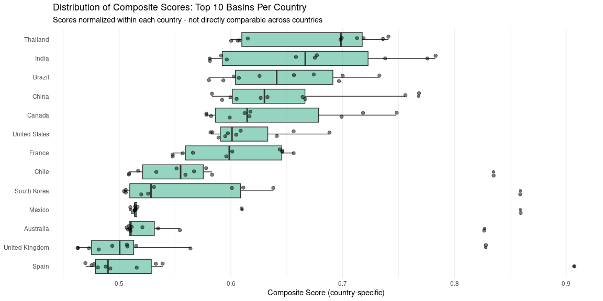

Figure 14: Distribution of composite scores across countries (top 10
basins per country). Note: Scores normalized within each country.

</div>

## Key Findings

### Methodology

For each country, we identified the top 10 Level 6 HydroBASINS based on
a composite score that equally weights four key metrics:

1.  **Wetland Area (25%)**: Total hectares of wetlands from GLWD
2.  **Carbon Storage (25%)**: Vulnerable carbon in wetlands
3.  **Protection Status (25%)**: Fraction of wetlands within WDPA
    protected areas
4.  **Nature’s Contributions (25%)**: Average NCP biodiversity score

### Interpretation

The composite score helps identify hydrobasins that balance multiple
conservation priorities: - High wetland area indicates ecological
significance - High carbon storage suggests climate mitigation
importance - Low protection fraction highlights conservation gaps - High
NCP scores indicate biodiversity value and ecosystem services

### Outputs

For each country, the analysis produces:

1.  **Complete basin file** (`priority_hydrobasins_all_<country>.csv`):
    All basins with wetlands, ranked by composite score
2.  **Country visualization** (`priority_hydrobasins_<country>.png`):
    Four-panel figure showing:
    - Top 10 basins by composite score
    - Breakdown of the four conservation criteria
    - Distribution of all basin scores
    - Relationship between wetland area and protection status
3.  **Regional identification**: Each basin labeled with its
    administrative region for spatial context
